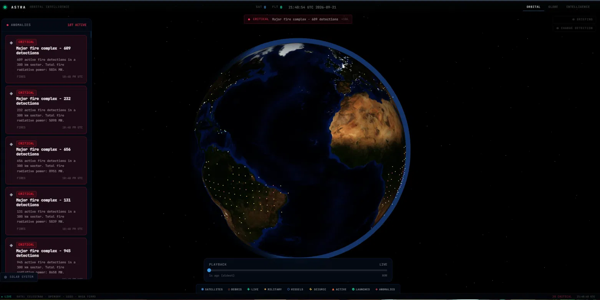
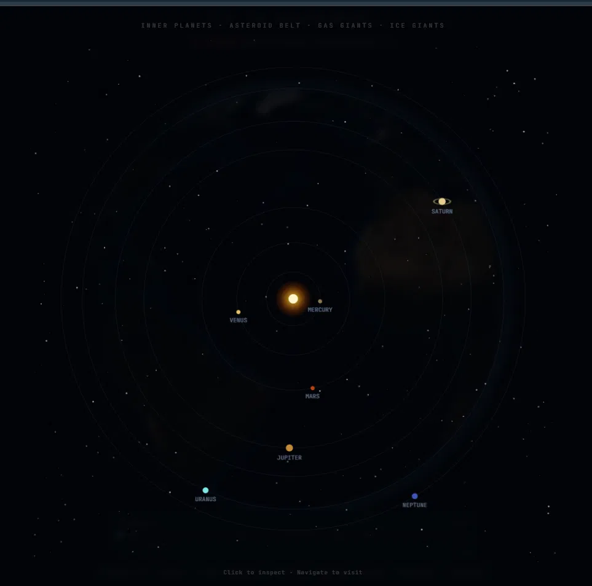
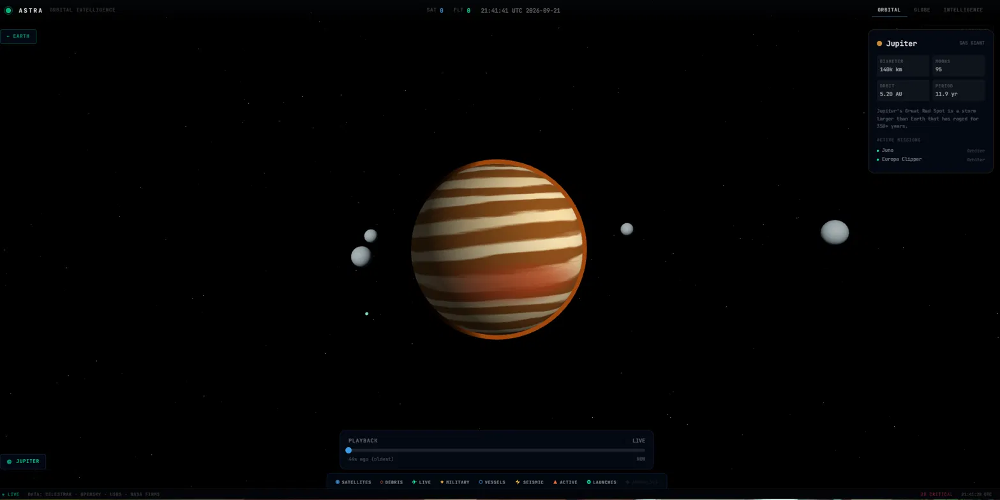

# ASTRA - Orbital Intelligence Platform

**Live geospatial intelligence from the perspective of space.**

ASTRA renders Earth and the solar system from orbital perspective, layering live satellite positions, flight data, maritime traffic, seismic activity, active fires, and AI-generated intelligence briefings into a single real-time 3D interface.

Where other platforms display data, ASTRA analyses it. Every layer talks to every other layer. Anomalies surface automatically. The AI knows what is happening across all feeds simultaneously and can brief you in two paragraphs.

---



*Earth from orbit - day/night GLSL shader driven by real sun direction, city lights on the dark side, live fire anomalies detected by the cross-layer analysis engine, 187 active anomalies flagged.*

---



*The solar system orrery - all eight planets at their real current positions for today's date, orbiting at correct relative orbital speeds. Click any planet to inspect it, navigate to visit.*

---



*Jupiter - procedural GLSL shader rendering horizontal cloud bands with turbulence, the Great Red Spot as an animated swirling storm, and four Galilean moons in orbit. Juno and Europa Clipper shown as active mission dots.*

---

## Architecture

```
astra/
├── apps/
│   ├── web/          Next.js 14 + Three.js + React Three Fiber
│   └── api/          FastAPI - proxies, caches, and analyses all live data
└── packages/
    └── shared/       TypeScript types
```

The web app runs entirely client-side. The API is a caching and analysis layer - it proxies external data sources, runs the anomaly detection engine, queries the Copernicus satellite imagery catalogue, and generates AI briefings. No database is required for the core experience; historical playback uses a local SQLite archive.

---

## Data sources

All free. No paid tiers required for core functionality.

| Layer | Source | Auth |
|---|---|---|
| Satellite TLEs | CelesTrak GP catalogue | None |
| Orbital propagation | satellite.js (SGP4) | Client-side |
| Live flights | adsb.fi community feed | None |
| Live vessels | AISStream WebSocket | Free key |
| Earthquakes | USGS GeoJSON feed | None |
| Active fires | NASA FIRMS VIIRS | Free key |
| Launches | Launch Library 2 | None |
| Satellite imagery | Copernicus CDSE (Sentinel-2) | None (metadata) |
| AI briefings | Groq API (llama3-8b-8192) | Free key |

---

## Stack

**Frontend**
- Next.js 14 (App Router)
- Three.js + React Three Fiber for 3D rendering
- Custom GLSL shaders for Earth day/night, atmosphere, and all planet surfaces
- satellite.js for SGP4 orbital propagation (runs client-side, updates every 2s)
- Zustand for global state
- Tailwind CSS with custom design tokens

**Backend**
- FastAPI with async route handlers
- httpx for non-blocking external API calls
- In-memory caching per data feed (TTLs from 15s for flights to 2h for TLEs)
- SQLite for historical playback snapshots (5-minute intervals, 24h retention)
- WebSocket connection to AISStream for live vessel positions
- Groq SDK for AI briefings with rule-based fallback

---

## Features

### Orbital layer
Live positions for 8,000+ satellites from the CelesTrak active catalog, Starlink megaconstellation, and debris objects. Each satellite is classified by type (payload, Starlink, military, weather, navigation, rocket body, debris) and colored accordingly. The ISS has a dedicated orbital ring showing its path. Click any satellite to open the detail panel and see its sensor footprint projected on Earth's surface.

### Flight layer
10,000+ live aircraft from the adsb.fi community ADS-B feed, updated every 15 seconds. Airborne aircraft rendered at their actual geometric altitudes. Military callsign pattern matching flags military aircraft in gold.

### Maritime layer
Live vessel positions from the AISStream WebSocket feed, continuously updated. Vessels broadcasting normally shown in blue. Vessels that have gone dark (AIS signal lost) shown in red as potential anomalies.

### Seismic layer
All M2.5+ earthquakes in the past 24 hours from the USGS real-time GeoJSON feed. Color-coded by magnitude from green (small) to red (large). Tsunami alerts flagged.

### Fire layer
Active fire detections from NASA FIRMS VIIRS satellite sensor. Each detection point includes fire radiative power (FRP) in megawatts, acquisition date, and satellite source.

### Anomaly detection
The cross-layer analysis engine runs on every `/anomalies` request:

- **Seismic swarms** - 3+ earthquakes within 200km in the same hour
- **Large earthquakes** - any M6.5+ event in the past 24 hours
- **Fire complexes** - 10+ FIRMS detections with combined FRP above 500MW
- **Flight density clusters** - grid cells with 2.5× the average aircraft density

Anomalies are sorted by severity (critical → high → medium → low) and displayed on the globe as colored dots, in the left panel as cards, and in the alert banner at the top.

### Change detection
Select any region on Earth, choose two dates, and ASTRA queries the Copernicus CDSE catalogue for Sentinel-2 L2A imagery. Returns the best available products by cloud cover, computes a change intensity score, infers change type (construction, vegetation, water, fire) from geographic location and season, and returns the affected area in km².

### AI briefings
Select a region and radius. ASTRA aggregates all active data feeds for that area - earthquakes, flights, vessels, fires, anomalies, launches - and generates a structured two-paragraph intelligence summary. Threat level assessed as ROUTINE / ELEVATED / HIGH / CRITICAL.

Powered by Groq's llama3-8b-8192 at zero cost (14,400 free requests per day). Falls back to a rule-based summary engine if no API key is set.

### Historical playback
The API snapshots flight, earthquake, and fire data every 5 minutes and retains 24 hours. The timeline scrubber at the bottom of the interface lets you seek to any point in the archive and replay the globe at that moment. Satellites are re-propagated to the historical timestamp using SGP4 - no storage required for orbital data.

### Planet navigation
The solar system orrery shows all eight planets at their real current positions, computed from J2000 epoch orbital elements and the current UTC date. Planets orbit at correct relative speeds in the animation. Click any planet to inspect its stats and active missions, then navigate to a full 3D view.

Each planet is rendered with a custom procedural GLSL shader:

| Planet | Visual treatment |
|---|---|
| Mercury | Cratered grey rock with basin regions and surface detail |
| Venus | Dense swirling cloud deck via domain-warped FBM noise |
| Mars | Rust terrain with volcanic highlands and polar ice caps |
| Jupiter | Horizontal cloud bands with turbulence and the Great Red Spot |
| Saturn | Layered golden bands with double ring disc |
| Uranus | Smooth cyan haze with faint band structure |
| Neptune | Deep blue with storm swirls and the Great Dark Spot |
| Sun | Animated convective cell surface, sunspots, corona glow, diffuse flare |

---

## Quick start

**Requirements:** Node.js 20+, Python 3.12+

```bash
git clone https://github.com/MA-V4/astra
cd astra
```

**API:**
```bash
cd apps/api
pip install -r requirements.txt
cp .env.example .env   # add your API keys
uvicorn src.main:app --reload --port 8000
```

**Web (new terminal):**
```bash
cd apps/web
npm install
npm run dev
```

Open `http://localhost:3000`.

Watch the API terminal for:
```
TLE cache refreshed: 8247 satellites
AISStream: connected, streaming positions
```

Satellites take 15-20 seconds to appear on first boot while the TLE cache populates.

---

## Environment variables

Create `apps/api/.env`:

```dotenv
GROQ_API_KEY=          # groq.com - free, 14,400 req/day
NASA_FIRMS_KEY=        # firms.modaps.eosdis.nasa.gov - free
AISSTREAM_API_KEY=     # aisstream.io - free
```

All three are optional. Without them, fires return empty, vessels return empty, and AI briefings fall back to rule-based summaries. The platform runs with full satellite, flight, earthquake, launch, and anomaly functionality using zero API keys.

---

## API reference

All endpoints return JSON. No authentication required.

| Endpoint | Description | Cache TTL |
|---|---|---|
| `GET /health` | Service status | None |
| `GET /satellites` | TLE catalog (8,000+ objects) | 2 hours |
| `GET /flights` | Live aircraft positions | 15 seconds |
| `GET /vessels` | Live vessel positions | Live WebSocket |
| `GET /earthquakes` | M2.5+ events, past 24h | 60 seconds |
| `GET /fires` | NASA FIRMS active detections | 10 minutes |
| `GET /launches` | Upcoming launches | 5 minutes |
| `GET /anomalies` | Cross-layer anomaly analysis | Computed on request |
| `GET /briefing?lat=&lon=&radius=` | AI region intelligence summary | 5 minutes |
| `GET /change-detection?lat=&lon=&radius=&before=&after=` | Sentinel-2 change analysis | 6 hours |
| `GET /history?ts=` | Historical data snapshot | SQLite |
| `GET /history/range` | Available archive window | None |

---

## Tests

```bash
cd apps/api
pytest tests/test_api.py -v
```

54 tests covering all API routes, the anomaly detector (haversine, swarm detection, fire clusters, severity sorting), the Sentinel-2 service (bbox geometry, change estimation, type inference), and the briefing service (region filtering, fallback logic, context summary). All run without any external API calls.

---

## Roadmap

- [x] Phase 0 - Skeleton, Earth sphere, star field, all data feeds wired
- [x] Phase 1 - Day/night GLSL shader, terminator, ISS ring, debris field, satellite footprint cones
- [x] Phase 2 - Cross-layer anomaly detection engine
- [x] Phase 3 - Sentinel-2 change detection via Copernicus CDSE
- [x] Phase 4 - AI region briefings (Groq + rule-based fallback)
- [x] Phase 5 - Historical playback with SQLite archive and timeline scrubber
- [x] Phase 6 - Solar system orrery, planet navigation, procedural planet shaders, Sun
- [ ] Phase 7 - Deployment (Vercel + Fly.io)
- [ ] Phase 8 - Satellite click selection on globe
- [ ] Phase 9 - Authenticated Sentinel-2 pixel-level imagery comparison
- [ ] Phase 10 - Historical satellite position archive (30-day TLE history)

---

## Project structure

```
apps/
  web/
    src/
      app/                    Next.js app router
      components/
        globe/
          Earth.tsx           Day/night GLSL shader with real sun direction
          Atmosphere.tsx      Atmospheric rim glow shader
          Terminator.tsx      Day/night boundary great-circle line
          ISSRing.tsx         ISS orbital path and current position
          Sun.tsx             Procedural solar surface with corona
          PlanetMaterial.tsx  GLSL shaders for all 8 planets
          PlanetScene.tsx     Three.js planet view with moons and missions
          GlobeScene.tsx      Main canvas, Earth scene, scene switching
          layers/
            SatLayer.tsx      Satellite point cloud (type-colored)
            FlightLayer.tsx   Live flight positions
            VesselLayer.tsx   AIS vessel positions
            QuakeLayer.tsx    Earthquake markers
            LaunchLayer.tsx   Launch pad markers
            AnomalyLayer.tsx  Anomaly dots (severity-colored)
            DebrisShell.tsx   Orbital debris field
            FootprintLayer.tsx Satellite sensor footprint cone
        panels/
          SidePanel.tsx       Selected object detail
          AnomalyPanel.tsx    Active anomalies list
          BriefingPanel.tsx   AI intelligence briefing
          ChangeDetectionPanel.tsx  Sentinel-2 analysis
        ui/
          TopBar.tsx          HUD - wordmark, live counts, UTC clock
          LayerBar.tsx        Layer toggle controls
          StatusBar.tsx       Bottom status strip
          AlertBanner.tsx     Highest-severity anomaly banner
          TimelineBar.tsx     Historical playback scrubber
          ViewControls.tsx    Briefing and change detection toggles
          OrreryNav.tsx       Animated solar system orrery
      hooks/
        useDataFeed.ts        All data polling intervals
      lib/
        api.ts                API client functions
        geo.ts                Coordinate conversion, haversine, footprint radius
        sgp4.ts               satellite.js wrapper for orbital propagation
        planets.ts            Planet data, orbital elements, mission manifest
      store/
        index.ts              Zustand global store
      types/
        index.ts              All TypeScript types

  api/
    src/
      main.py                 FastAPI app, startup tasks
      routes/
        satellites.py         CelesTrak TLE proxy
        flights.py            adsb.fi flight proxy
        vessels.py            AISStream WebSocket collector
        earthquakes.py        USGS proxy
        fires.py              NASA FIRMS proxy
        launches.py           Launch Library 2 proxy
        anomalies.py          Cross-layer anomaly route
        change_detection.py   Sentinel-2 route
        briefing.py           AI briefing route
        history.py            Historical playback route
      services/
        anomaly_detector.py   Detection engine (swarms, clusters, large events)
        sentinel.py           Copernicus CDSE catalogue queries
        briefing.py           Groq integration + rule-based fallback
        history.py            SQLite snapshot archive
    tests/
      test_api.py             54 tests, no external calls required
```

---

## License

MIT

---

## Author

**Mihran Ali**

[mihranali.vercel.app](https://mihranali.vercel.app) · [github.com/MA-V4](https://github.com/MA-V4) · [mihran.ali.v4@gmail.com](mailto:mihran.ali.v4@gmail.com)